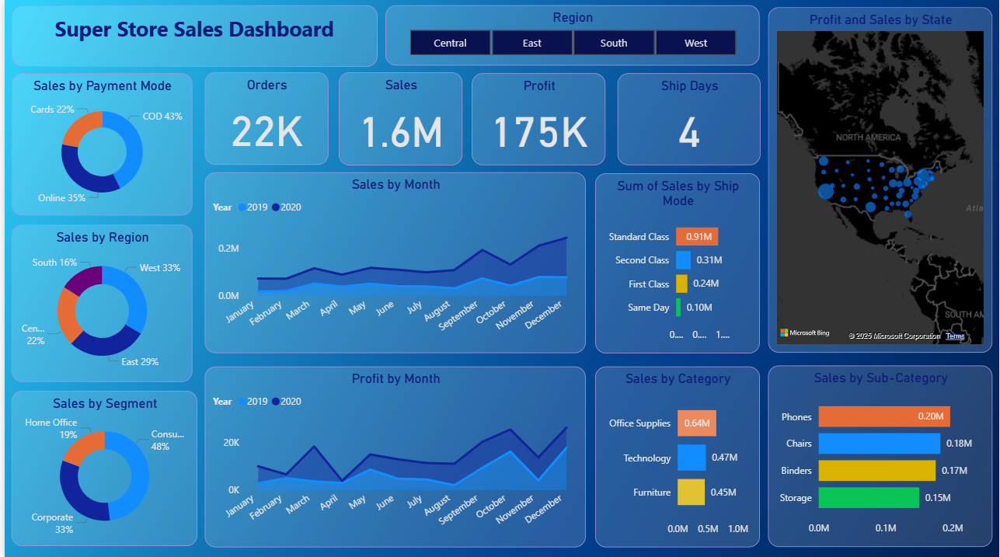
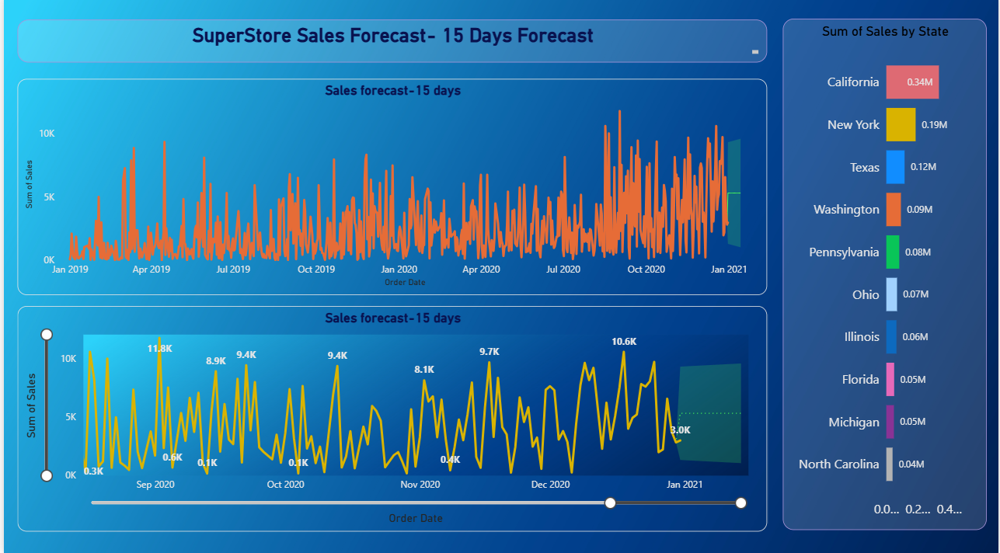

# SuperStore-Sales-Dashboard
<h1 align="center">🏬 SuperStore Sales Dashboard & Forecasting (Power BI)</h1>

<h2>📊 Project Overview</h2>

This Power BI project visualizes and analyzes <b>SuperStore Sales Data</b> to uncover key business insights and forecast future sales trends.  
It provides an interactive and data-driven view of sales performance across regions, categories, and time.

<ul>
  <li>Sales distribution across regions, payment modes, and categories</li>
  <li>Monthly trends in orders, profits, and shipments</li>
  <li>15-day future sales forecast based on historical data</li>
</ul>

<h2>🧠 Objectives</h2>
<ul>
  <li>To analyze overall sales and profit performance</li>
  <li>To identify high-performing regions, categories, and customer segments</li>
  <li>To evaluate sales modes and shipping efficiency</li>
  <li>To forecast future sales for better business decision-making</li>
</ul>

<h2>🧩 Dashboard Features</h2>

<h3>📈 Super Store Sales Dashboard</h3>

<b>Main KPIs:</b>

<ul>
  <li>Total Orders: <b>22K</b></li>
  <li>Total Sales: <b>1.6M</b></li>
  <li>Total Profit: <b>175K</b></li>
  <li>Average Ship Days: <b>4</b></li>
</ul>

<b>Visual Insights:</b>

<ul>
  <li>Sales by Payment Mode: COD, Online, Cards</li>
  <li>Sales by Region: East, West, Central, South</li>
  <li>Sales by Segment: Consumer, Corporate, Home Office</li>
  <li>Sales by Category & Sub-Category: Technology, Furniture, Office Supplies</li>
  <li>Sales and Profit by Month (2019-2020)</li>
  <li>Profit and Sales by State (Map Visualization)</li>
  <li>Sales by Ship Mode (Standard, Second, First, Same Day)</li>
</ul>

<h3>🔮 Sales Forecast Dashboard</h3>
<ul>
  <li>15-Day Sales Forecast using Power BI’s forecasting model</li>
  <li>State-wise Sales Comparison: California, New York, Texas, Washington, etc.</li>
  <li>Highlights of top-performing states</li>
  <li>Forecast visualized through line and area charts</li>
</ul>

<h2>🛠 Tools & Technologies</h2>
<ul>
  <li><b>Tool:</b> Power BI Desktop</li>
  <li><b>Data Source:</b> SuperStore Sales Dataset (CSV/Excel)</li>
  <li><b>Techniques Used:</b>
    <ul>
      <li>DAX measures for KPIs</li>
      <li>Time-series forecasting</li>
      <li>Data modeling and relationships</li>
      <li>Interactive filters and slicers</li>
    </ul>
  </li>
</ul>

<h2>📷 Screenshots</h2>

<h3>1️⃣ Super Store Sales Dashboard</h3>

This is the main <b>Super Store Sales Dashboard</b> showing KPIs and region-wise sales performance.

<h3>2️⃣ Sales Forecast Dashboard</h3>

This shows the <b>15-day sales forecast</b> along with state-wise sales comparison.

